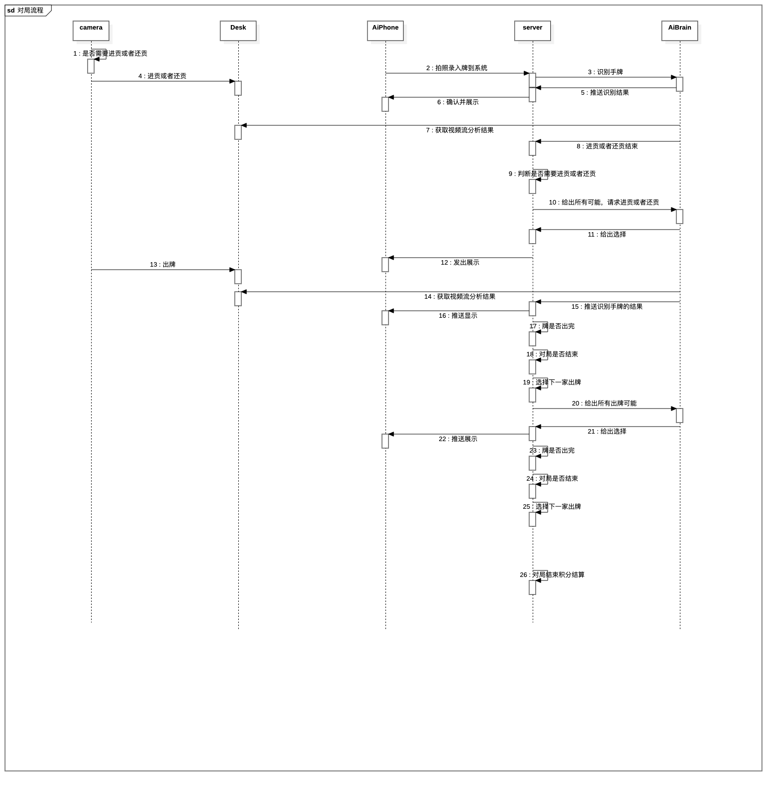
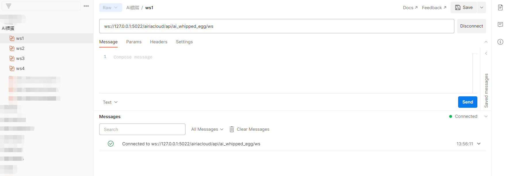
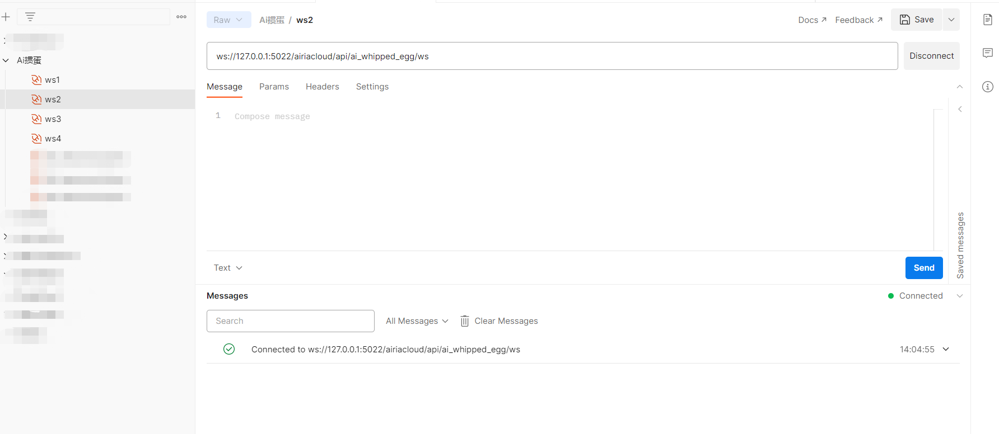
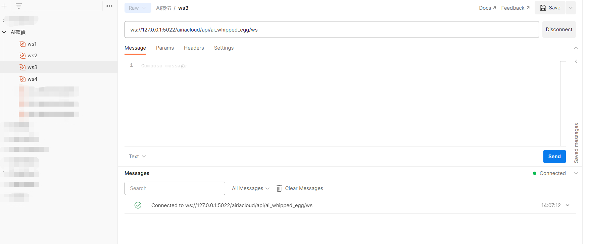
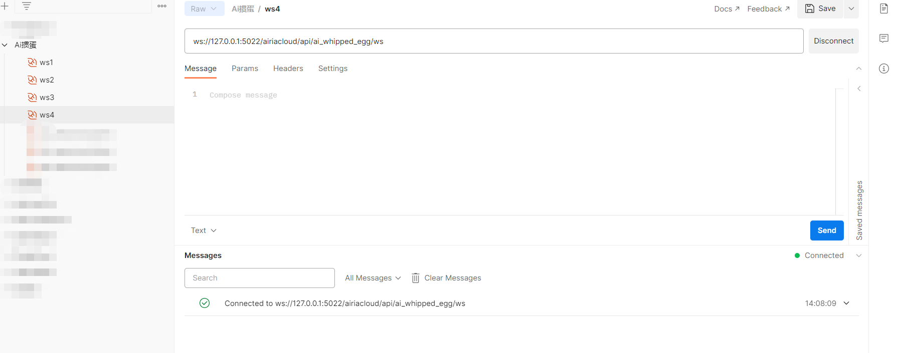
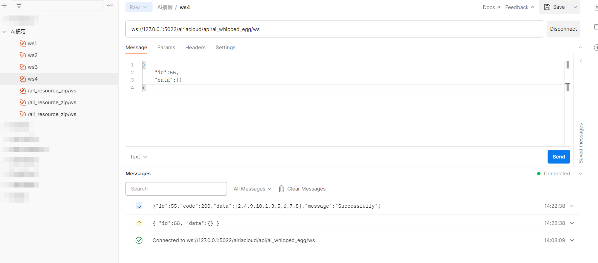
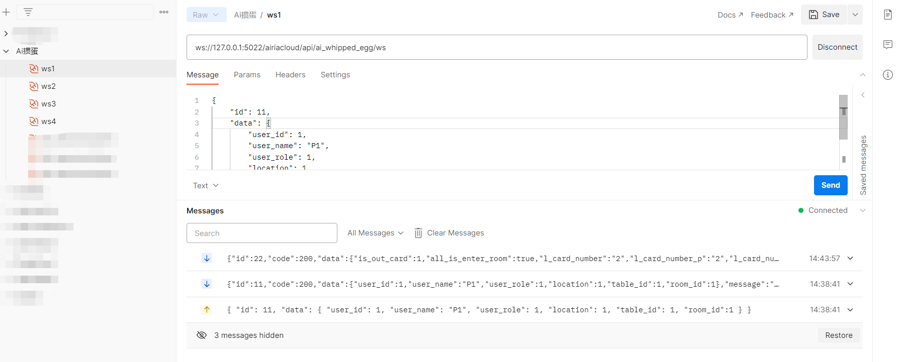
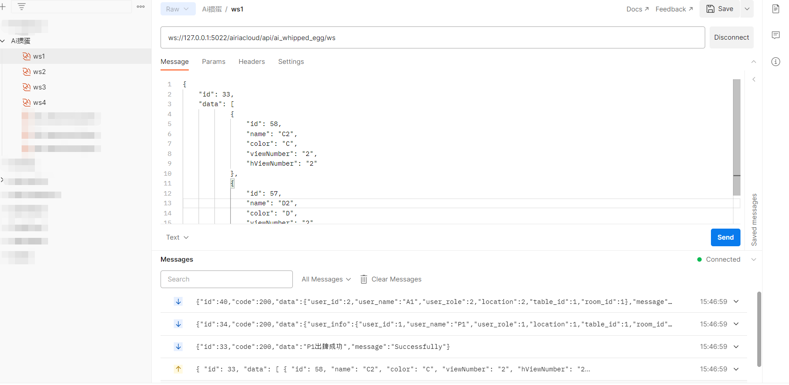

# ai-guandan
go语言开发的Ai掼蛋游戏后台服务

## project init
```
go mod init ai-guandan
go mod tidy -v
```
####Ai掼蛋交互流程
>
####用postman模拟四个掼蛋玩家客户端
#####1. 玩家1
>
#####2. 玩家2
>
#####3. 玩家3
>
#####4. 玩家4
>
####获取剩余未满的桌号
#####id
```
id:55
```
#####req
```
{
    "id":55,
    "data":{}
}
```
#####resp
```
{
	"id": 55,
	"code": 200,
	"data": [1, 2, 3, 4, 5, 6, 7, 8, 9, 10],
	"message": "Successfully"
}
```
>
####开始游戏(P1,P2,A1,A2四人都进入游戏才会发牌)
#####id
```
id:11
```
#####req
######P1进入
```
{
	"id": 11,
	"data": {
		"user_id": 1,
		"user_name": "P1",
		"user_role": 1,
		"location": 1,
		"table_id": 1,//第一个房间
        "room_id":1 //1:四人线上模式；2:人机对战模式
	}
}
```
######A1进入
```
{
	"id": 11,
	"data": {
		"user_id": 2,
		"user_name": "A1",
		"user_role": 2,
		"location": 2,
		"table_id": 1,//第一个房间
        "room_id":1 //1:四人线上模式；2:人机对战模式
	}
}
```
######P2进入
```
{
	"id": 11,
	"data": {
		"user_id": 3,
		"user_name": "P2",
		"user_role": 1,
		"location": 3,
		"table_id": 1,//第一个房间
        "room_id":1 //1:四人线上模式；2:人机对战模式
	}
}
```
######A2进入
```
{
	"id": 11,
	"data": {
		"user_id": 4,
		"user_name": "A2",
		"user_role": 2,
		"location": 4,
		"table_id": 1,//第一个房间
        "room_id":1 //1:四人线上模式；2:人机对战模式
	}
}
```
#####resp
######P1,P2,A1,A2四人都进入游戏后发牌,下面是P1收到的27张手牌
```
{
    "id": 22,
    "code": 200,
    "data": {
        "is_out_card": 1,
        "all_is_enter_room": true,
        "l_card_number": "2",
        "l_card_number_p": "2",
        "l_card_number_a": "2",
        "cards": [
            {
                "id": 58,
                "name": "C2",
                "color": "C",
                "viewNumber": "2",
                "hViewNumber": "2"
            },
            {
                "id": 57,
                "name": "D2",
                "color": "D",
                "viewNumber": "2",
                "hViewNumber": "2"
            },
            {
                "id": 56,
                "name": "S2",
                "color": "S",
                "viewNumber": "2",
                "hViewNumber": "2"
            },
            {
                "id": 6,
                "name": "S3",
                "color": "S",
                "viewNumber": "3",
                "hViewNumber": "3"
            },
            {
                "id": 16,
                "name": "C5",
                "color": "C",
                "viewNumber": "5",
                "hViewNumber": "5"
            },
            {
                "id": 15,
                "name": "D5",
                "color": "D",
                "viewNumber": "5",
                "hViewNumber": "5"
            },
            {
                "id": 67,
                "name": "H5",
                "color": "H",
                "viewNumber": "5",
                "hViewNumber": "5"
            },
            {
                "id": 13,
                "name": "H5",
                "color": "H",
                "viewNumber": "5",
                "hViewNumber": "5"
            },
            {
                "id": 68,
                "name": "S5",
                "color": "S",
                "viewNumber": "5",
                "hViewNumber": "5"
            },
            {
                "id": 77,
                "name": "D7",
                "color": "D",
                "viewNumber": "7",
                "hViewNumber": "7"
            },
            {
                "id": 81,
                "name": "D8",
                "color": "D",
                "viewNumber": "8",
                "hViewNumber": "8"
            },
            {
                "id": 79,
                "name": "H8",
                "color": "H",
                "viewNumber": "8",
                "hViewNumber": "8"
            },
            {
                "id": 85,
                "name": "D9",
                "color": "D",
                "viewNumber": "9",
                "hViewNumber": "9"
            },
            {
                "id": 29,
                "name": "H9",
                "color": "H",
                "viewNumber": "9",
                "hViewNumber": "9"
            },
            {
                "id": 36,
                "name": "CT",
                "color": "C",
                "viewNumber": "T",
                "hViewNumber": "T"
            },
            {
                "id": 40,
                "name": "CJ",
                "color": "C",
                "viewNumber": "J",
                "hViewNumber": "J"
            },
            {
                "id": 94,
                "name": "CJ",
                "color": "C",
                "viewNumber": "J",
                "hViewNumber": "J"
            },
            {
                "id": 91,
                "name": "HJ",
                "color": "H",
                "viewNumber": "J",
                "hViewNumber": "J"
            },
            {
                "id": 38,
                "name": "SJ",
                "color": "S",
                "viewNumber": "J",
                "hViewNumber": "J"
            },
            {
                "id": 43,
                "name": "DQ",
                "color": "D",
                "viewNumber": "Q",
                "hViewNumber": "Q"
            },
            {
                "id": 41,
                "name": "HQ",
                "color": "H",
                "viewNumber": "Q",
                "hViewNumber": "Q"
            },
            {
                "id": 42,
                "name": "SQ",
                "color": "S",
                "viewNumber": "Q",
                "hViewNumber": "Q"
            },
            {
                "id": 96,
                "name": "SQ",
                "color": "S",
                "viewNumber": "Q",
                "hViewNumber": "Q"
            },
            {
                "id": 46,
                "name": "SK",
                "color": "S",
                "viewNumber": "K",
                "hViewNumber": "K"
            },
            {
                "id": 52,
                "name": "CA",
                "color": "C",
                "viewNumber": "A",
                "hViewNumber": "A"
            },
            {
                "id": 105,
                "name": "DA",
                "color": "D",
                "viewNumber": "A",
                "hViewNumber": "A"
            },
            {
                "id": 108,
                "name": "HR",
                "color": "H",
                "viewNumber": "R",
                "hViewNumber": "R"
            }
        ],
        "is_resist": true
    },
    "message": "Successfully"
}
```
######第一把刚开始随机四人中的一人出牌，随机到P1出牌，同时通知其他三个玩家P1出牌
```
{
    "id": 40,
    "code": 200,
    "data": {
        "user_id": 1,
        "user_name": "P1",
        "user_role": 1,
        "location": 1,
        "table_id": 1,
        "room_id": 1
    },
    "message": "Successfully"
}
```
>
####玩家出牌
>如果P1玩家出的牌不符合出牌规则就会通知P1玩家，他出的牌不符合规则，叫P1重新出牌
>
>如果P1玩家出的牌符合规则就会通知P1出牌成功了，并且把P1出的牌同时发给牌桌上的四个玩家显示,通知下一位出牌的A1玩家去出牌(出牌顺序P1>A1>P2>A2>P1)
#####id
```
id:33
```
#####req
```
{
	"id": 33,
	"data": [
            {
                "id": 58,
                "name": "C2",
                "color": "C",
                "viewNumber": "2",
                "hViewNumber": "2"
            },
            {
                "id": 6,
                "name": "S3",
                "color": "S",
                "viewNumber": "3",
                "hViewNumber": "3"
            }]
}
```
```
{
	"id": 33,
	"data": [
            {
                "id": 58,
                "name": "C2",
                "color": "C",
                "viewNumber": "2",
                "hViewNumber": "2"
            },
            {
                "id": 57,
                "name": "D2",
                "color": "D",
                "viewNumber": "2",
                "hViewNumber": "2"
            }]
}
```
#####resp
######出的牌型不符合规则
```
{
    "id": 33,
    "code": 2002,
    "data": {
        "user_id": 1,
        "user_name": "P1",
        "user_role": 1,
        "location": 1,
        "table_id": 1,
        "room_id": 1
    },
    "message": "识别到的牌不符合出牌规则,请重新识别"
}
```
######单独通知A1出的牌型符合规则
```
{
    "id": 33,
    "code": 200,
    "data": "P1出牌成功",
    "message": "Successfully"
}
```
######通知四个玩家A1出的什么牌
```
{
    "id": 34,
    "code": 200,
    "data": {
        "user_info": {
            "user_id": 1,
            "user_name": "P1",
            "user_role": 1,
            "location": 1,
            "table_id": 1,
            "room_id": 1
        },
        "cards": [
            {
                "id": 58,
                "name": "C2",
                "color": "C",
                "viewNumber": "2",
                "hViewNumber": "2"
            },
            {
                "id": 57,
                "name": "D2",
                "color": "D",
                "viewNumber": "2",
                "hViewNumber": "2"
            }
        ],
        "remain_cards_num": 25
    },
    "message": "Successfully"
}
```
######通知A1去出牌，只有A1会收到此条消息
```
{
    "id": 35,
    "code": 200,
    "data": 0,
    "message": "Successfully"
}
```
######除A1玩家外的其他三个玩家会收到，现在轮到A1玩家出牌的消息
```
{
    "id": 40,
    "code": 200,
    "data": {
        "user_id": 2,
        "user_name": "A1",
        "user_role": 2,
        "location": 2,
        "table_id": 1,
        "room_id": 1
    },
    "message": "Successfully"
}
```
>
####退出此局比赛
#####id
```
id:66
```
#####req
```
{
    "id":66,
    "data":{}
}
```
#####resp
######退出的玩家
```
{
     "id": 66,
    "code": 200,
    "data":” 退出成功”,
    "message": "Successfully"
}
```
######其他玩家
```
{
     "id": 66,
    "code": 200,
    "data":” P1玩家退出此局比赛”,
    "message": "Successfully"
}
```
####进入牌桌
#####id
```
id:10
```
#####req
```
{
	"id": 10,
	"data": {
		"user_id": 1,
		"user_name": "P1",
		"user_role": 1,
		"location": 1,
		"table_id": 1,//必填
        "room_id":1//必填
	}
}
```
#####resp
```
{
	"id": 10,
	"data": [{
		" user_name": “P1”,
		"is_entered": true //true:已进入；false:未进入 
	}, {
		" user_name": “A1”,
		"is_entered": true //true:已进入；false:未进入 
	}]
}
```
####再进入下发牌信息
#####resp
######此玩家
```
id:12
```
```
{
	"id": 12,
	"code": 200,
	"data": {
		"user_info": {
			"user_id": 1,
			"user_name": "P1",
			"user_role": 1,
			"location": 1,
			"table_id": 1
		},
		”is_out_card”: true, // 是否出牌; false:不出牌，true:出牌
		”is_must_out_card”: true, // 是否必须出牌;false:不必须，true:必须
		”l_card_number”: ”2”, //通配牌牌点
		”cards”: [{”
			id”: 11,
			”name”: ”H2”,
			”color”: ”H”,
			”viewNumber”: ”2”,
			”hViewNumber”: ”2”,
			”level”: 2
		}, ]
	},
	"message": "Successfully"
}
```
######通知其他玩家
```
id:13
```
```
{
	"id": 13,
	"code": 200,
	"data": {
		"user_id": 1,
		"user_name": "P1",
		"user_role": 1,
		"location": 1,
		"table_id": 1
	},
	"message": "Successfully"
}
```
####一局结束
#####id
```
id:38
```
#####resp
```
{
	"id": 38,
	"code": 200,
	"data": {“
		ranking_infos”: [{
				"ranking ": 1, //排名
				"user_id": 1,
				"user_name": "P1",
				"user_role": 1,
				"location": 1,
				"table_id": 1
			},
			{
				"ranking ": 2, //排名
				"user_id": 2,
				"user_name": "P2",
				"user_role": 2,
				"location": 2,
				"table_id": 1
			}
		],
		“score”: 3 //上游的一方此局得分
	},
	"message": "Successfully"
}
```
####再来一局
#####id
```
id:44
```
#####req
```
{
	"id": 44,
	"data":{}
}
```
#####resp
```
{
	"id": 22,
	"code": ,
	"data": {
		”is_out_card”: 1, //是否出牌
		”all_is_enter_room”: true, //此牌桌的所有玩家是否都进入并准备好；false：未准备好；true：已准备好
		”l_card_number”: ””, //此局打的通配牌牌点
		”l_card_number_p”: ””, //P方通配牌牌点
		”l_card_number_a”: ””, //A方通配牌牌点
		”cards”: [{”
			id”: 11,
			”name”: ”H2”,
			”color”: ”H”,
			”viewNumber”: ”2”,
			”hViewNumber”: ”2”,
			”level”: 2
		},],
		”is_resist”: true, //此局是否抗贡;false:不抗贡，true:抗贡
	},
	"message": ""
}
```
####通知四个玩家这局存在抗贡
#####id
```
id:23
```
#####resp
```
{
	"id": 23,
	"code": 200,
	"data": "存在抗贡",
	"message": "Successfully"
}
```
####通知要进贡的玩家进贡
#####id
```
id:24
```
#####resp
```
{
	"id": 24 "code": 200,
	"data": "此局你要进贡啦",
	"message": "Successfully"
}
```
####通知要还贡的玩家还贡
#####id
```
id:25
```
#####resp
```
{
	"id": 25,
	"code": 200,
	"data": "此局你要还贡啦",
	"message": "Successfully"
}
```
####玩家进贡
#####id
```
id:77
```
#####req
```
{
	"id": 77,
	"data": {
		"user_info": {
			"user_id": 1,
			"user_name": "P1",
			"user_role": 1,
			"location": 1,
			"table_id": 1
		}
	},
	"card": {
	    ”id”: 11,
		”name”: ”H2”,
		”color”: ”H”,
		”viewNumber”: ”2”,
		”hViewNumber”: ”2”,
		”level”: 2
	}
}
```
#####resp
######进贡牌是否符合通知
```
{
     "id": 77,
    "code": 200,
    "data":”进贡牌符合要求”,
    "message": "Successfully"
}
```
######进贡返回牌
```
{
	"id": 78,
	"code": 200,
	"data": {
		"id”: 11,
		”name”: ”H2”,
		”color”: ”H”,
		”viewNumber”: ”2”,
		”hViewNumber”: ”2”,
		”level”: 2
	},
	"message": "Successfully"
}
```
######通知进贡最大的牌出第一手牌
```
{
     "id": 90,
    "code": 200,
    "data":”进贡完你出第一手牌”,
    "message": "Successfully"
}
```
####玩家还贡
#####id
```
id:88
```
#####req
```
{
	"id": 88,
	"data": {
		"user_info": {
			"user_id": 1,
			"user_name": "P1",
			"user_role": 1,
			"location": 1,
			"table_id": 1
		}
	},
	"card": {
		”id”: 11,
		”name”: ”H2”,
		”color”: ”H”,
		”viewNumber”: ”2”,
		”hViewNumber”: ”2”,
		”level”: 2
	}
}
```
#####resp
######还贡牌是否符合通知
```
{
     "id": 88,
    "code": 200,
    "data":”还贡牌符合要求”,
    "message": "Successfully"
}
```
######还贡返回牌
```
{
    "id": 89,
    "code": 200,
    "data":{
          ”id”:11, 
          ”name”:”H2”,
          ”color”:”H”,
          ”viewNumber”:”2”,
          ”hViewNumber”:”2”,
          ”level”:2},
    "message": "Successfully"
}
```
####心跳上传
#####id
```
id:1
```
#####req
```
{
    "id":1,
    "data":{}
}
```
#####resp
```
{
     "id": 1,
    "code": 200,
    "data":{},
    "message": "Successfully"
}
```
####断开重连
#####id
```
id:45
```
#####req
```
{
  "id": 45,
  "data": {
  "user_id":1,
  "user_name":"P1",
  "user_role":1,
  "location":1,
  "table_id":1
  }
}
```
#####resp
######此玩家
```
{
	"id": 14,
	"code": 200,
	"data": {
		"user_info": {
			"user_id": 1,
			"user_name": "P1",
			"user_role": 1,
			"location": 1,
			"table_id": 1
		},
		”is_out_card”: true, // 是否出牌; false:不出牌，true:出牌
		”is_must_out_card”: true, // 是否必须出牌;false:不必须，true:必须
		”l_card_number”: ”2”, //通配牌牌点
		”cards”: [{”
			id”: 11,
			”name”: ”H2”,
			”color”: ”H”,
			”viewNumber”: ”2”,
			”hViewNumber”: ”2”,
			”level”: 2
		}, ]
	},
	"message": "Successfully"
}
```
######通知其他玩家
```
{
  "id": 15,
  "code": 200,
  "data":{
  "user_id":1,
  "user_name":"P1",
  "user_role":1,
  "location":1,
  "table_id":1},
    "message": "Successfully"
}

```
####设置设置玩家手牌
#####id
```
id:110
```
#####req
```
{
	"id": 110,
	"data": {
		"user_info": {
			"user_id": 1,
			"user_name": "P1",
			"user_role": 1,
			"location": 1,
			"table_id": 1,
			"room_id": 1
		},
		"cards": ["H2","H3","H4","HR","H5","H6","H7","H8","H9","HJ"]//27张牌
	}

}
```
#####resp
```
{
	"id": 110,
	"code": 200,
	"data": {},
	"message": "Successfully"
}
```